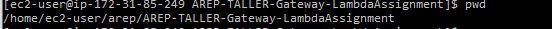

# AREP-TALLER-Gateway-LambdaAssignment

En este laboratoria se realizara un lambda el cual se encargara de desplegar el grograma que le pasaremos en este caso square que eleva un numero al cuadrado. Luego se implementara un api Gateway quien se encargara de resolver las peticiones mediante la url y re direccionarlas al lambda.

## Empezando

Estas instrucciones ofrecerán una guía de como utilizar la copia del programa que usted podrá tener en su maquina local para fines de desarrollo y prueba.

### Prerrequisitos

**Java**

Se necesitara del java JDK 1.8, para verificar que se tiene abriremos nuestra terminal o consola de comando y ejecutaremos el siguiente comando:

```
java -version
java version "1.8.0_221"
Java(TM) SE Runtime Environment (build 1.8.0_221-b11)
Java HotSpot(TM) 64-Bit Server VM (build 25.221-b11, mixed mode)
```

En caso de no tenerlo se podra descargar de [java](https://www.oracle.com/technetwork/java/javase/downloads/jdk8-downloads-2133151.html)

**Maven**

Se necesitara de Maven para ejecutar el programa, para eso se verificara si se tiene con `mvn -v` en caso de no tenerlo se podrá hacer [aqui](https://maven.apache.org/install.html)

## Pruebas

- Prueba del lambda inicial

  

- Prueba lambda al value

  
  

- Prueba lambda mandando cualquier value

  

- Prueba directa a la url del Api Gateway

  

- Copia del repositorio en la EC2

  

- Poner a funcionar el proyecto Spark dentro de la EC2 para hacer la petición

  

- Url de la EC2 quien da el formulario para ingresar al numero

  
  

- Resolución del cuadrado del número
  

- Metodo de petición del servidor EC2 al Api Gateway

```java
public static String getResult(String number) throws ParseException, IOException {
        HttpGet request = new HttpGet(url + number);
        try (CloseableHttpResponse response = httpClient.execute(request)) {

            // Get HttpResponse Status
            System.out.println(response.getStatusLine().toString());

            HttpEntity entity = response.getEntity();
            Header headers = entity.getContentType();
            System.out.println(headers);

            if (entity != null) {
                // return it as a String
                String result = EntityUtils.toString(entity);
                System.out.println(result);
                return result;
            }
        }
        return "404";
    }
```

## Generar javaDocs

Para generar el javaDocs utilizaremos `mvn javadoc:javadoc`

## Autores

- Cristian López

## Licencia

- GNU General Public License v3.0
